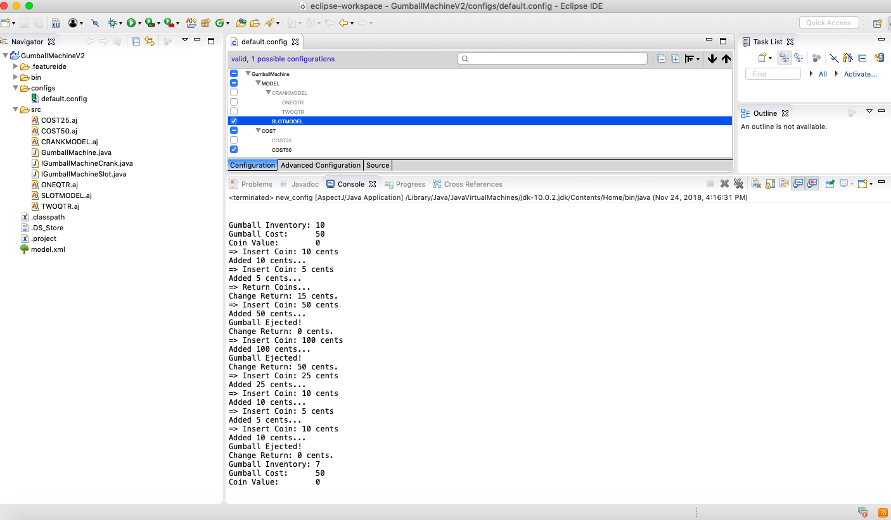

## Gumball Machine using FeatureIDE

### Comparison with Lab1

In lab1 we either had to handle all possible cases in our GumballMacine constructor (which would give a complex method code smell) or use inheritance to extend three different gumball machines which would have landed us with too many classes trying to do a common functionality i.e release a gumball.

In case of using Aspectj and FeatureIDE, though there are similar number of classes, the configurations are use friendly and easily understandable.

### Outputs

Below are the four possible combinations for the type of machine (crank/slot) and the amout it takes in total (25/50).

### Slot Machine that takes in 25 cents

### Slot Machine that takes in 50 cents

### Crank Machine taking only on quarter

### Crank Machine taking only two quarter

